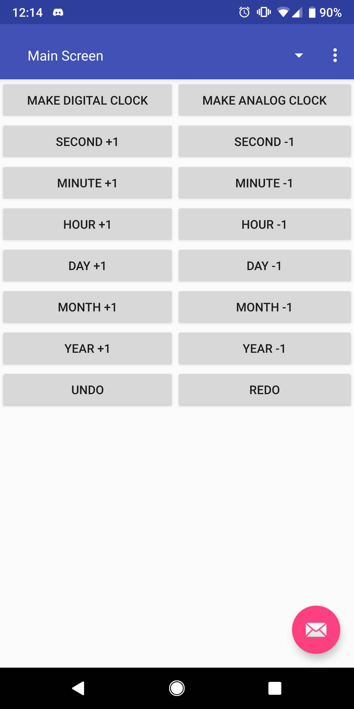
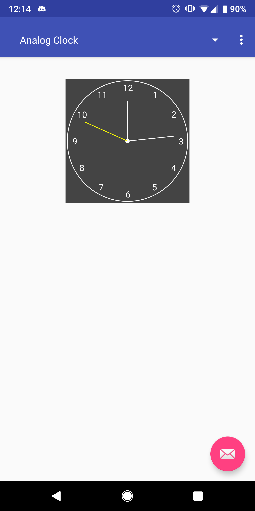
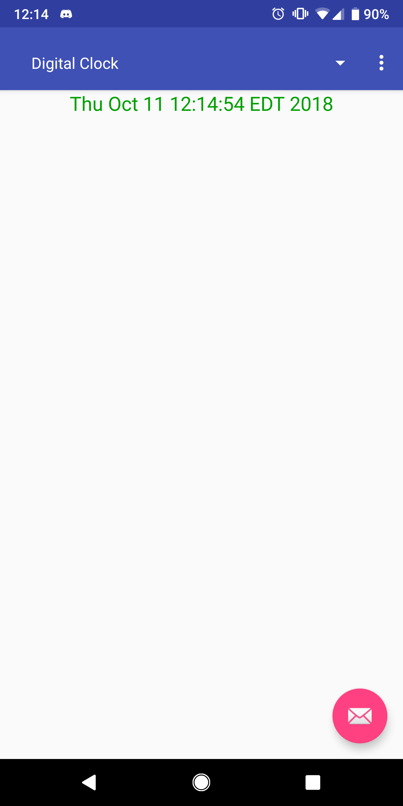

# ceg4110-homework-1

Link to GitHub: https://github.com/aar118/ceg4110-homework-2

This is a homework assignment 2 for Wright State University's Introduction to Software Engineering class. 
The goal of this homework assignment was to use MVC and command design patterns to make application that spawns multiple clock views.

## Getting Started

These instructions will get you a copy of the project up and running on your local machine for development and testing purposes. See deployment for notes on how to deploy the project on a live system.

### Prerequisites

A phone with the latest Android version installed, which is currently version 9.

### Installing

1. Download the GitHub directory.
2. Extract the folder
3. Navigate to and open bin/app-release.apk
4. Install application

## Built With

* [Kotlin](https://kotlinlang.org/) - The web framework used
* [Android Studio](https://developer.android.com/studio/) - IDE
* [Gradle](https://gradle.org/) - Dependency Management
* [Analog Clock](https://viblo.asia/p/simple-way-to-create-a-custom-analog-clock-in-android-1VgZv9aRKAw) - Used to build my analog clock
* [Digital Clock](https://developer.android.com/reference/android/widget/DigitalClock) - Used to build my digital clock

## Authors

* **Aaron Hammer** - *Developed* - [aar118](https://github.com/aar118)

## Additional Design Notes

**Model**
I decided to make the model a custom calendar that I built off of using the system time. There were many ways to go about making my own custom calendar. My buttons increment and decrement each value of the calender by 1, so I decided to just have a thread that always updates the custom calender to the current system time + the custom value. So, if someone decrements the hour to -2, the time is the current time's hour - 2. It's a very simple solution that seemed to have worked.

**Controller**
The controller probably took the most time out of everything. My biggest challenge was figuring out how to dynamically add custom fragments and be able to update all of the custom clock widgets inside of those fragments. I decided to make an arraylist of custom fragments so that the controller could manipulate it as needed, and then replace the custom adapter inside of the spinner when adding new ones when a button is pressed. It sounds complicated, but once I figured it out, it was really easy. The learning curve was just a little steep.

**View**
The view took some time, but only because I was trying to figure out what the AnalogClock and DigitalClock deprecated classes do exactly. I was able to make my own custom DigitalClock by passing in my own calendar, whereas for custom AnalogClock I just found a tutorial on how to make an analog clock, and then added pieces of code from my custom DigitalClock in that. It was a lot more learning than actual coding.

**Command**
At first, I actually forgot to implement command design aspects. It was mostly trivial, though, because I just had to separated my MainActivity class into the Commands and CommandQ. The CommandQ implements the undo/redo functionality.